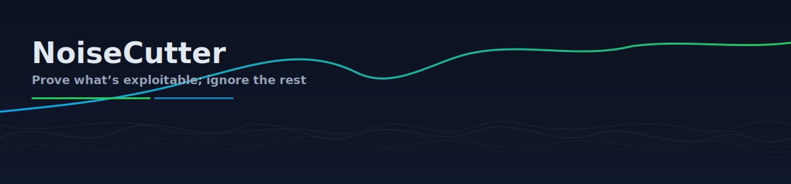
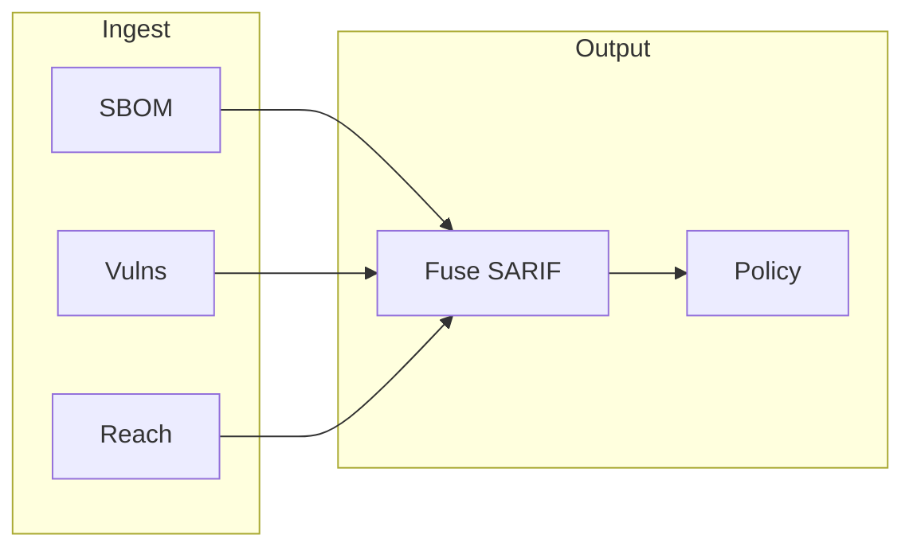

<p align="center">
  
</p>

<p align="center">
  <strong>Prove what is exploitable. Ignore the rest.</strong><br />
  <sub>Reachability-aware vulnerability triage from SBOM to SARIF—built for CI.</sub>
</p>

<p align="center">
  <a href="https://pypi.org/project/noisecutter/"></a>
  <a href="LICENSE"></a>
  
</p>

---

Most scanners flood you with every CVE that touches a dependency. **NoiseCutter** narrows the signal: it ties advisories to **what your application can actually reach** from real entry points, then outputs **SARIF** so you can enforce policy in GitHub and other tools—without pretending unreachable code is an imminent production risk.

| Aspect | Details |
| :----- | :------ |
| **Inputs** | CycloneDX SBOM, OSV-backed vulns, language-native reach data (Go today) |
| **Outputs** | SARIF, policy pass/fail, reproducible JSON for golden tests |
| **Where it runs** | Developer machines, CI, containers—beside Syft, govulncheck, and the OSV API |



---

### Contents

- [Install](#install)
- [Run a full pipeline](#run-a-full-pipeline)
- [Prerequisites](#prerequisites)
- [Reproducibility](#reproducibility)
- [Samples](#samples)
- [Configuration](#configuration)
- [CI & automation](#ci--automation)
- [Documentation](#documentation)
- [Security](#security)
- [License](#license)

---

### Install

**From PyPI**

```bash
pip install noisecutter
```

**From this repository** (locked deps, matches CI)

```bash
uv sync --extra dev
uv run noisecutter --help
```

**Container**

```bash
docker run --rm ghcr.io/noisecutter/noisecutter:latest --help
```

---

### Run a full pipeline

The following assumes **Syft** is available (`PATH` or `SYFT_EXE` on Windows). Adjust paths if you run from a different working directory.

```bash
noisecutter sbom --source . --out sbom.cdx.json
noisecutter audit --sbom sbom.cdx.json --out vulns.json
noisecutter reach --lang go --entry ./examples/go-mod-sample/cmd/server \
  --vulns vulns.json --out reach.json
noisecutter fuse --sbom sbom.cdx.json --vulns vulns.json --reach reach.json --out report.sarif
noisecutter policy --sarif report.sarif --level high --fail-on reachable
```

Quick check:

```bash
noisecutter --help
```

---

### Prerequisites

| Topic | What you need |
| ----- | ------------- |
| **Go reachability** | Go toolchain; `govulncheck` pinned per [`tool-versions.json`](tool-versions.json), e.g. `go install golang.org/x/vuln/cmd/govulncheck@v1.2.0`; in samples run `go mod tidy` where a `go.mod` exists |
| **SBOM** | [Syft](https://github.com/anchore/syft) on `PATH`, or checksum-based install: [`scripts/install-syft.sh`](scripts/install-syft.sh) / [`scripts/install-syft.ps1`](scripts/install-syft.ps1) |
| **Windows** | If the console entry point misbehaves, use `python -m noisecutter`; for encoding issues, `PYTHONIOENCODING=utf-8` and UTF-8 code page (`chcp 65001`) help |

---

### Reproducibility

Stable, diff-friendly outputs:

- Export **`NOISECUTTER_STRICT_REPRO=1`** (optional: **`SOURCE_DATE_EPOCH`**)
- Pin Syft / govulncheck versions in [`tool-versions.json`](tool-versions.json) and in CI

---

### Samples

| Sample | Purpose |
| ------ | ------- |
| [`examples/go-mod-sample`](examples/go-mod-sample) | Single entry point—minimal walkthrough |
| [`examples/go-multi-entry`](examples/go-multi-entry) | Two entries, golden verification (`make all_artifacts`, `make verify-golden`) |

---

### Configuration

- **CLI:** `--log-level`, `--repo`, `--strict-repro`
- **File:** optional **`.noisecutter.yaml`** at the repo root (fields in [`noisecutter/config.py`](noisecutter/config.py))
- **Env:** `NOISECUTTER_LOGGING_CONFIG`, `NOISECUTTER_LOG_FILE`, `NOISECUTTER_LOG_JSON`

---

### CI & automation

Workflows under [`.github/workflows/`](.github/workflows/):

| Workflow | Role |
| -------- | ---- |
| `ci.yml` | Lint, types, tests, spell check, pip-audit (Python **3.9–3.13**) |
| `pr.yml` | Go multi-entry goldens; Windows test smoke |
| `release.yml` | Build, attest, PyPI (OIDC), GHCR, GitHub Release |
| `codeql.yml` | CodeQL (Python) |
| `dependency-review.yml` | Dependency review on PRs |

[Dependabot](.github/dependabot.yml) maintains **`uv.lock`** and GitHub Actions bumps. Workflow details are in [CONTRIBUTING.md](CONTRIBUTING.md#ci-workflows).

---

### Documentation

| Guide | What you will find |
| :---- | :----------------- |
| [Quickstart](docs/QUICKSTART.md) | First-time setup and commands |
| [Integrations](docs/INTEGRATIONS.md) | GitHub Actions, GitLab, Jenkins |
| [Why reachability?](docs/WHY_REACHABILITY.md) | Concepts |
| [Threat model](docs/THREAT_MODEL.md) | Risks and mitigations |
| [Exceptions](docs/EXCEPTION_PLAYBOOK.md) | Policy exceptions |
| [Troubleshooting](docs/TROUBLESHOOTING.md) | Syft, govulncheck, OSV, Windows |
| [RFC template](docs/RFC_TEMPLATE.md) | Design proposals |
| [Contributing](CONTRIBUTING.md) | Dev setup and tests |
| [Releases](https://github.com/noisecutter/noisecutter/releases) | Version history and notes |

---

### Security

Report vulnerabilities **privately**: see [SECURITY.md](SECURITY.md). Published packages include a **Security** project URL when built from this repository.

---

### License

[Apache License 2.0](LICENSE).
